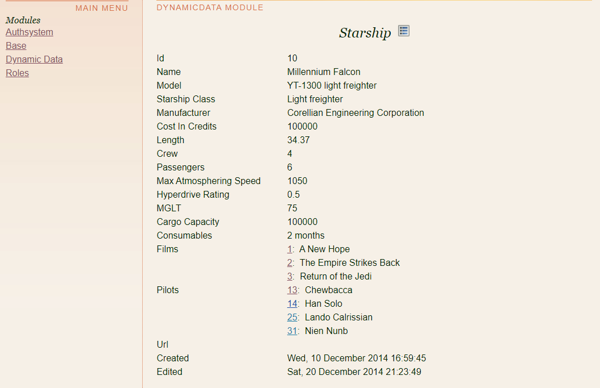

## API Schemas

This Xaraya module provides a playground to experiment with API schemas, including:
- creating dynamicdata objects from [JSON schema files](resources/schemas/)
- using defermany properties to establish [many-to-many links](resources/mapping.json) between dynamicdata objects
- loading items from [JSON data files](resources/fixtures/)
- [TODO] providing access to these objects via REST API
- [TODO] adapting an existing [GraphQL schema](graphql/)

You can view the imported objects via the dynamicdata user interface, and follow the many-to-many links there:

https://owncloud.mikespub.net/bermuda/index.php?object=api_starships&method=display&itemid=10

The inspiration for these experiments is the Stars Wars API (SWAPI) and the SWAPI GraphQL Wrapper to https://swapi.dev/

